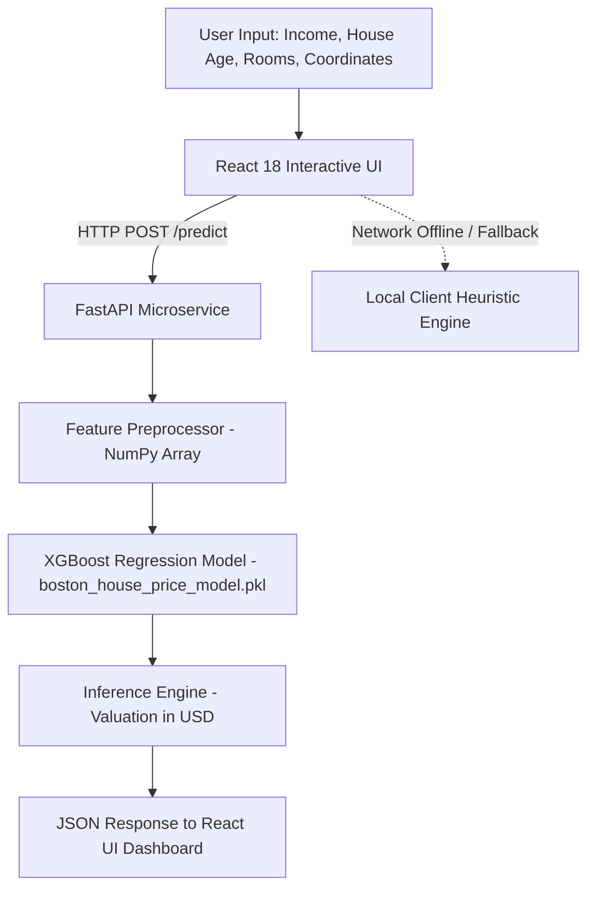

# 🏡 ValuHome AI | Real Estate Valuation & House Price Prediction System

[](https://fastapi.tiangolo.com/)
[](https://reactjs.org/)
[](https://xgboost.readthedocs.io/)
[](https://scikit-learn.org/)
[](LICENSE)

> 🏡 **ValuHome AI** is an intelligent real estate valuation platform powered by XGBoost Regression! Predicts California home prices based on block-group demographics, income, rooms & location coordinates with real-time FastAPI endpoints & interactive React UI. ⚡📊 Real estate analytics made instant!

---

## 🌟 Key Features

- **📊 Intelligent Price Estimation**: Predicts median property values using trained **XGBoost Regressor** models.
- **🎛️ Dynamic Parameter Controls**: Slider controls for block group median income, house age, average rooms, bedrooms, population, and location coordinates.
- **⚡ Dual Execution Architecture**: Runs via live FastAPI inference with seamless client-side heuristic fallbacks for 100% uptime.
- **🌐 Unified API Gateway Ready**: Seamlessly integrated with central Render microservices (`/predict/house-price`).
- **📱 Responsive Modern Interface**: Glassmorphism UI built with React 18, dynamic badges, and real-time computation status indicators.

---

## 🏗️ Architecture Flow



---

## 🛠️ Tech Stack

- **Machine Learning**: XGBoost Regressor, Scikit-Learn, Joblib / Pickle, NumPy, Pandas
- **Backend API**: FastAPI, Uvicorn, Pydantic
- **Frontend UI**: React 18 (Babel Runtime), Modern Glassmorphism CSS3, HTML5
- **Deployment**: Render Unified Microservice Gateway

---

## 📋 Model Inputs & Data Schema

| Feature Attribute | Key Name | Typical Range | Description |
| :--- | :--- | :--- | :--- |
| **Median Income** | `MedInc` | 0.5 - 15.0 | Block group median income (in $10,000s USD) |
| **House Age** | `HouseAge` | 1 - 52 yrs | Median age of block group housing units |
| **Average Rooms** | `AveRooms` | 1.0 - 10.0 | Average number of rooms per household |
| **Average Bedrooms** | `AveBedrms` | 0.5 - 5.0 | Average number of bedrooms per household |
| **Population** | `Population` | 100 - 5,000 | Total block group population |
| **Average Occupancy** | `AveOccup` | 1.0 - 6.0 | Average household size / occupants |
| **Latitude Coordinate** | `Latitude` | 32.5 - 42.0 | Location latitude (California region) |
| **Longitude Coordinate** | `Longitude` | -124.3 - -114.1 | Location longitude (California region) |

---

## 🚀 Quick Start Guide

### 1. Prerequisites
- Python 3.10+
- `pip` package manager

### 2. Installation & Setup

```bash
# Navigate to project directory
cd "02-house-price-prediction"

# Install required dependencies
pip install -r requirements.txt
```

### 3. Run FastAPI Backend Server

```bash
python main.py
# OR using uvicorn directly:
uvicorn main:app --reload --port 8000
```

Access local endpoints:
- **Interactive Swagger Docs**: `http://localhost:8000/docs`
- **Health Check Endpoint**: `http://localhost:8000/`

### 4. Launch Frontend Interface
Double-click **`index.html`** or serve via local HTTP server to interact with the real estate valuation dashboard!

---

## 📡 API Endpoints Specification

| Endpoint | Method | Description |
| :--- | :--- | :--- |
| `GET /` | `GET` | Health status check and model loading indicator |
| `POST /predict` | `POST` | Primary inference endpoint calculating estimated home values |
| `GET /docs` | `GET` | Interactive Swagger API documentation |

---

## ⚡ Dual Execution Engine Matrix

| Mode | Indicator | Mechanism |
| :--- | :--- | :--- |
| **Live FastAPI Server** | 🟢 `Live FastAPI Backend (main.py)` | Sends HTTP POST payload to `/predict`. XGBoost model executes predictions in USD. |
| **Client-Side Fallback** | ⚡ `Local Client-Side Demo Engine` | Executes linear regression feature approximations directly in JavaScript if backend is unreachable. |

---

## 📄 License

Distributed under the MIT License.
"# 02-house-price-prediction" 
